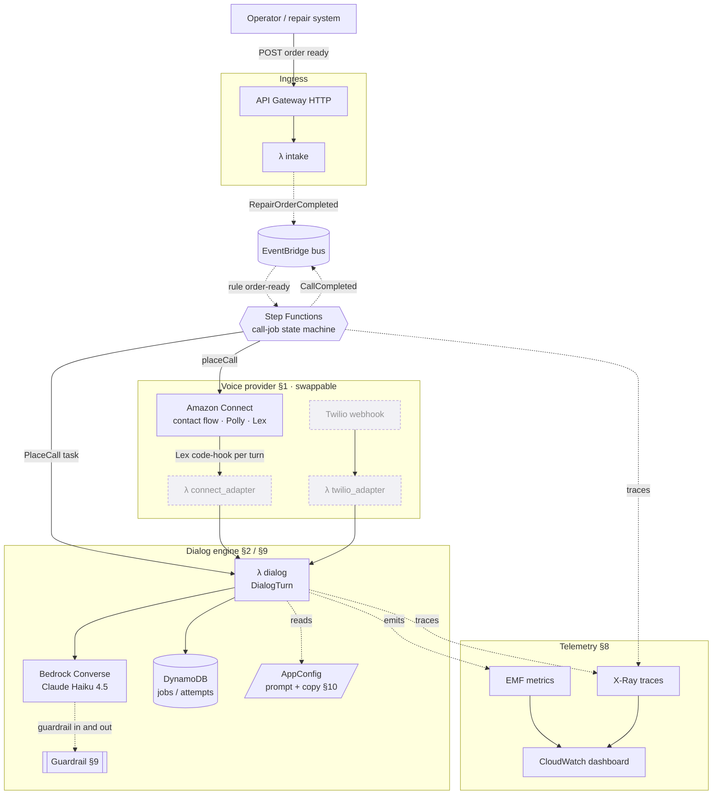
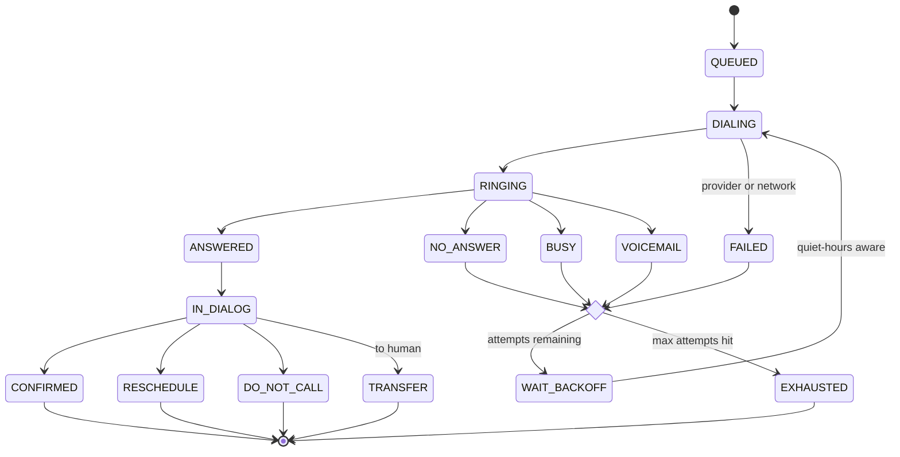
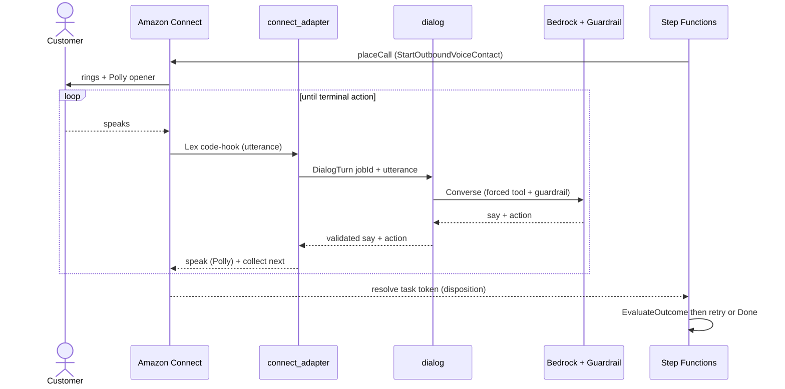

# Diagrams

Rendered Mermaid views of the system. These render on GitHub and in VS Code with a
Mermaid preview extension. Narrative and rationale live in [ARCHITECTURE.md](ARCHITECTURE.md);
section refs (§) point there.

---

## 1. Architecture

Deployed components plus the swappable voice layer (§1) and telemetry (§8). Solid arrows =
request/data flow; dotted = async events, config reads, and telemetry.

> Dashed-border nodes (`connect_adapter`, Twilio path) are scaffolded but not yet wired —
> the live-call turn loop (diagram 3) is the target. Only one voice provider is
> instantiated at a time (`voice_provider` var).

---

## 2. Call lifecycle (state machine)

The per-notification Step Functions job (§8). Retryable dispositions loop through backoff;
terminal outcomes end the execution.

> Idempotency: the Step Functions execution name is the `jobId`, so a duplicate
> `RepairOrderCompleted` can't start a second call for the same order (§8).

---

## 3. Live-call turn loop (sequence) — target

How the Lambdas are invoked during a real call (Phase B). Each caller utterance drives one
`DialogTurn`; the provider resolves the Step Functions task token on a terminal disposition.

> Provider swap (§1): with `voice_provider = "twilio"`, replace Connect + `connect_adapter`
> with a Twilio webhook then `twilio_adapter` then the same `dialog` Lambda. Same brain, different mouth.
